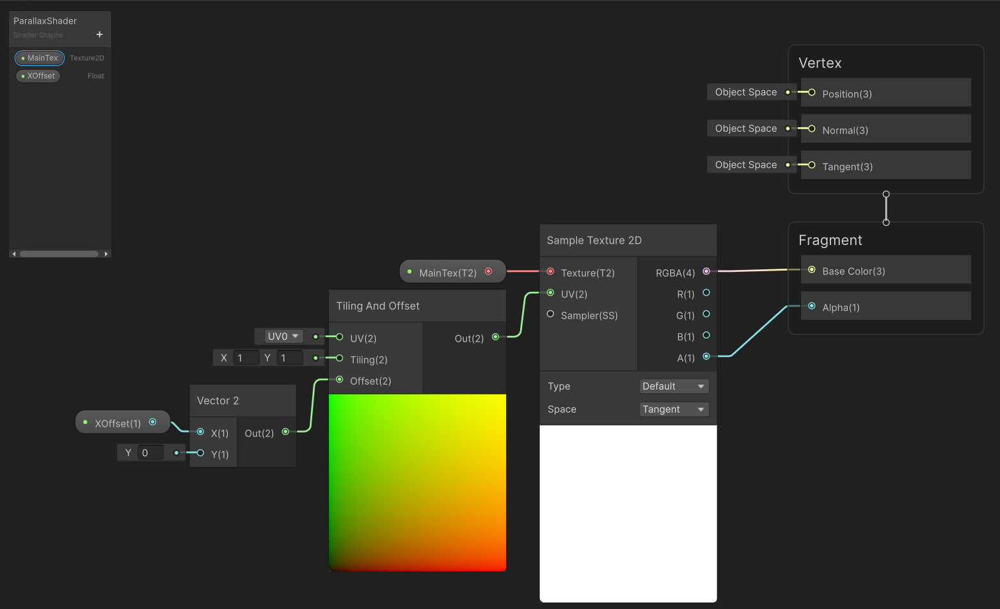
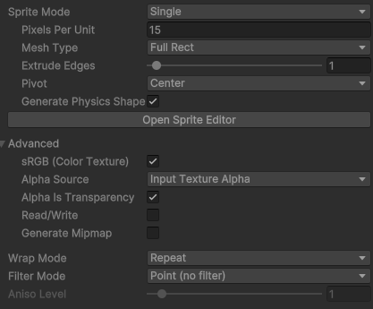
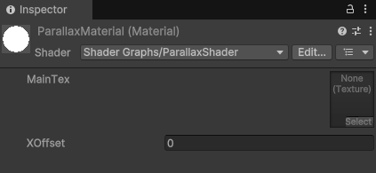
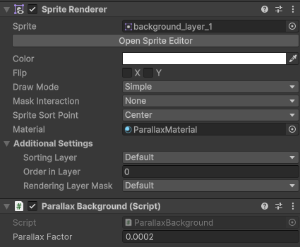

# 2D Parallax Shader

Very simple 2D Parallax Shader.

This is a 2D Unlit Shader. The material made from this is meant to be used with the parallax background script, a sprite renderer and a camera tagged as MainCamera.

In order for this shader to work correctly.  Sprites need to be imported with the Mesh Type set to Full Rect and the Wrap Mode set to Repeat.

This material is applied to the sprite renderer component and gets the texture element filled via the parallax background script.

The closer the parallax factor is to 1 - the closer the camera will follow the background layer.  The best bet is to choose a number between 0 and 1 - with the furthest background layer scrolling the slowest (closer to 0).

